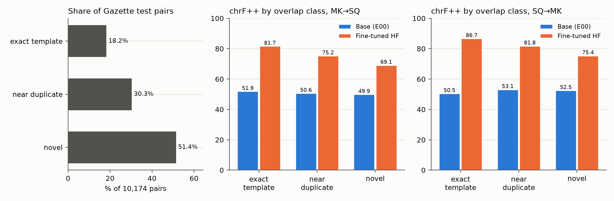
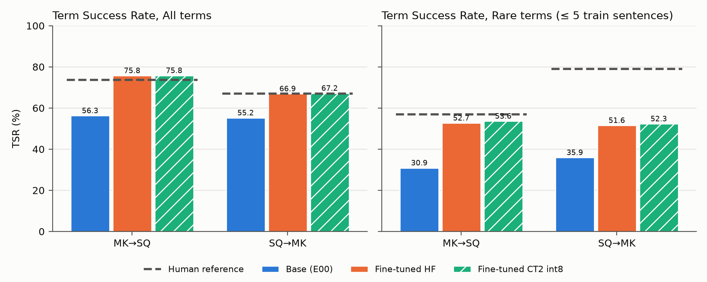
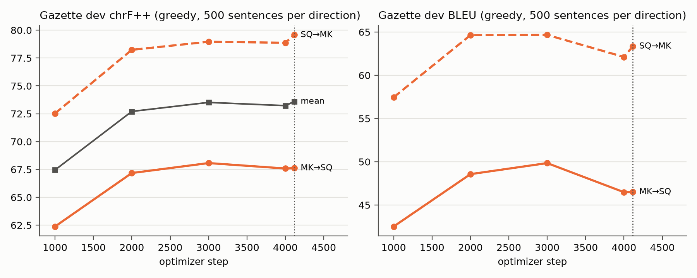
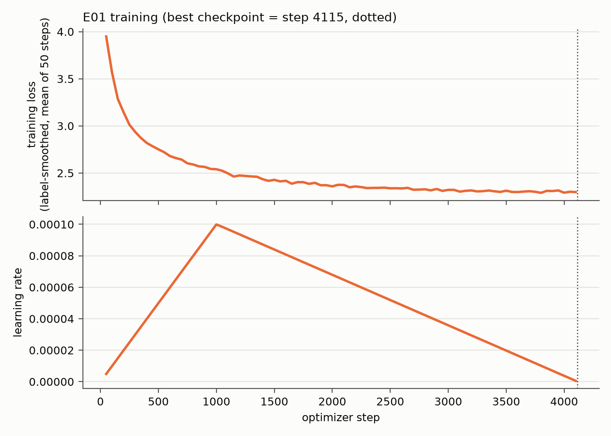

# Experiment report: E01_gazette_verbis_mix

Combined lexicon-aware system (closest research-design arm: M7-mix + D3); baseline E00_base (arm M0). Generated 2026-09-22T10:50:06+00:00 by `experiments/E01_gazette_verbis_mix/build_report.py` from results repo revision `3fad45be925bbdc88e6b07672628ba8e1b180178` and git commit `1fec5bb2f30bc004bef4dfb5c7dd1b7ea294d39b`. Every number below is in `results.json`; every artifact is listed with its sha256 in `MANIFEST.json`.

## 1. Summary

NLLB-200-distilled-600M was fully fine-tuned in both directions (Macedonian↔Albanian) in a single run on 526,704 tokenised examples drawn from the Gazette parallel corpus (88.8%), Verbis term pairs (5.6%) and LaBSE-filtered Verbis definition pairs (5.7%), for one epoch (4,115 optimizer steps, 1.361 h on one RTX 5080). On the full Gazette test set (10,174 pairs), BLEU rose from 27.74 to 54.02 (MK→SQ) and from 29.63 to 63.64 (SQ→MK), and chrF++ from 50.3 to 72.28 and from 52.46 to 78.55 (paired bootstrap p = 0.001 for every in-domain comparison). On the novel subset (51.42% of test pairs, with no template or near-duplicate match in training), BLEU rose from 26.46 to 48.83 (MK→SQ) and from 29.93 to 58.59 (SQ→MK). On the general-domain sets FLORES+ and NTREX-128, BLEU fell by 2.5 to 5.0 points; 7 of 8 comparisons were significant declines (not significant: FLORES+ SQ→MK chrF++). The CTranslate2 int8 export stayed within 0.23 BLEU of the HF model. The main caveats are a single seed, a test set in which 48.58% of pairs are templates or near duplicates of training sentences, and the combination of Gazette and Verbis data in one run, which prevents attributing any effect to the lexicon.

## 2. Research questions

The wording of the research questions is defined in the research design and is NOT RECORDED in the sources used for this report; only the mapping given for this experiment is used here.

- **RQ1** — informed: the in-domain effect of fine-tuning on Gazette + Verbis data (§5.1, §5.2).
- **RQ5** — informed: retention of general-domain quality on FLORES+ and NTREX-128 (§5.1, §6).
- **RQ6** — partly informed: terminology and number behaviour (§5.3, §5.4) and int8 deployment (§5.5).
- **RQ2–RQ4** — not answerable from this run: Gazette and Verbis data were combined in one training mixture, so the contribution of the lexical resource cannot be isolated from that of the parallel corpus. This requires the Gazette-only arm (§9).

## 3. Data

### 3.1 Gazette parallel corpus

- Source: Hugging Face dataset `EdonFetaji/slvesnik-mk-sq` (licence recorded on the dataset card: cc-by-4.0). Revision used by the run: NOT RECORDED. At report time the dataset was at `07af5bbbb2a2c5277e3eb9c032a86682148fb269`, last modified 2026-09-21 09:59:27+00:00, which precedes the first run invocation (2026-09-21 19:46:49 UTC); this is a timing fact, not a record of the revision used.
- Splits loaded: train, validation, test. Sizes: train 270,083, dev 13,355, test 10,174 pairs. Dev was the published 'validation' split (no hold-out was created).
- Split method: issue-disjoint. Computed from the dataset at `07af5bbbb2a2c5277e3eb9c032a86682148fb269`: 90 test issues (issue_key), 0 of which occur among the 2,099 train issues.

### 3.2 Verbis dictionary

- Source: APJ (Agjencia e Zbatimit të Gjuhës), API `https://api.verbis.gov.mk/api/words` (`scripts/verbis_harvest.py`). The dataset used by the run (`data/verbis/verbis_mk_sq.parquet` in the private repo) had 15,925 entries.
- Crawl date: NOT RECORDED. Categories crawled: NOT RECORDED. The local harvest cache (`scripts/verbis_cache/`) holds 3,610 unique entries, which does not match the 15,925 entries used, so it cannot establish either fact. The harvest script's docstring states a total that also differs from the dataset used.
- Cleaning: the harvest script forces each field into a single script (Cyrillic/Latin homoglyph repair). The training script stripped trailing parenthetical qualifiers and Albanian inflection endings from headwords, lowercased all-capital headwords longer than 4 characters, dropped empty sides and removed duplicate pairs.
- Term pairs kept: 15,093. Definition pairs: 15,822 scored with LaBSE, 15,305 kept at LaBSE ≥ 0.7 (96.7%; median score 0.939).
- Licence status: redistribution requires the Agency's permission (scripts/verbis_harvest.py); stored privately. No Verbis entry is reproduced in this report.

### 3.3 External test sets

- FLORES+ devtest (`openlanguagedata/flores_plus`, mkd_Cyrl / als_Latn): 1,012 sentences; licence cc-by-sa-4.0 (dataset card at `5fec6c13f9e5a4db2f745d4ec0d7c9721ddc4f06`). Revision used by the run: NOT RECORDED.
- NTREX-128 (`github.com/MicrosoftTranslator/NTREX`, mkd / sqi): 1,997 sentences; licence CC-BY-SA-4.0 (LICENSE.md at `468c6b69c7f6a75d31d4743d9daba2af566cc18d`). Revision used by the run: NOT RECORDED (downloaded from branch main).

### 3.4 Leakage removal, length filter and composition

Training pairs whose Macedonian or Albanian side (lowercased, whitespace-normalised) occurs in Gazette dev, Gazette test, FLORES+ or NTREX-128 were removed: 30,157 Gazette pairs (11.17% of Gazette train), 25 Verbis term pairs and 0 definition pairs. Each of the 270,299 remaining pairs was used in both directions (270,299 examples per direction), and 13,894 examples (2.57%) longer than 192 tokens were dropped.

| Quantity | Value |
|---|---|
| Gazette train / dev / test (pairs) | 270,083 / 13,355 / 10,174 |
| Removed as leakage: Gazette / Verbis terms / Verbis definitions | 30,157 / 25 / 0 |
| Clean training pairs | 270,299 |
| Bidirectional examples | 540,598 |
| Dropped by length filter (> 192 tokens) | 13,894 (2.57%) |
| Tokenised training examples | 526,704 |
| Composition: gazette | 479,852 (88.8%) |
| Composition: verbis defs | 30,610 (5.7%) |
| Composition: verbis terms | 30,136 (5.6%) |

Source: eval/run_info.json (dataset_sizes), progress.log

## 4. Model and training

The base model `facebook/nllb-200-distilled-600M` (snapshot `f8d333a098d19b4fd9a8b18f94170487ad3f821d`) was trained with full-parameter supervised fine-tuning, bidirectional (MK→SQ and SQ→MK in one model). The per-device batch size was chosen by a memory probe on worst-case 192-token batches: batch 16 ran out of memory (peak 14.97 GB), batch 8 succeeded (peak 10.97 GB), giving 8 × 16 = 128 examples per optimizer step. Training ran for 4,115 steps in 1.361 h (median 110.4 samples/s, 11,711 non-padding tokens/s; peak allocated GPU memory 12.64 GB; maximum GPU temperature 58.0 °C; 0 training warnings). The mean training loss fell from 3.94911 (first 50 steps) to 2.29786 (last logged interval). The checkpoint with the highest mean dev chrF++ (evaluated every 1,000 steps and at the final step) was step 4,115 (73.6).

Hardware: NVIDIA GeForce RTX 5080 (16.61 GB, compute capability 12.0, driver 595.84); CPU NOT RECORDED; RAM NOT RECORDED. Software: Python 3.12.3, torch 2.14.0+cu130, transformers 5.17.0, datasets 5.0.1, accelerate 1.15.0, ctranslate2 4.8.2, sacrebleu 2.6.0, sentence-transformers 6.1.0. Training code: commit `540e36cf359e550afb39bd5bddab35d2ccec9376` (clean working tree: True).

| Setting | Value |
|---|---|
| Base model | facebook/nllb-200-distilled-600M |
| Base model snapshot | f8d333a098d19b4fd9a8b18f94170487ad3f821d |
| Method | full-parameter SFT, bidirectional |
| Optimizer | adafactor |
| Learning rate | 0.0001 |
| Schedule | linear, warmup 1000 steps |
| Epochs | 1 |
| Label smoothing | 0.1 |
| Weight decay | 0.01 |
| Max grad norm | 1.0 |
| Precision | bf16 mixed precision, TF32 matmul |
| Batch (per device × accumulation) | 8 × 16 = 128 |
| Gradient checkpointing | False |
| Batch sampling | group_by_length |
| Max length (tokens, drop not truncate) | 192 |
| Seed / data seed | 42 / 42 |
| Total optimizer steps | 4,115 |
| Evaluation / checkpoint interval | 1000 steps |
| Checkpoint selection | eval_chrf (mean dev chrF++ of both directions) |
| Best step / dev chrF++ mean | 4115 / 73.6 |
| Training time (h) | 1.361 |

Source: eval/run_info.json, checkpoints/checkpoint-4115/trainer_state.json

## 5. Results

All test-set scores use beam 4 and at most 256 new tokens. BLEU signature `nrefs:1|case:mixed|eff:no|tok:13a|smooth:exp|version:2.6.0`; chrF++ signature `nrefs:1|case:mixed|eff:yes|nc:6|nw:2|space:no|version:2.6.0`.

### 5.1 Main results

| Test set | Dir. | System | n | BLEU | chrF++ | ΔBLEU | ΔchrF++ | p (BLEU) | p (chrF++) |
|---|---|---|---|---|---|---|---|---|---|
| Gazette test | MK→SQ | Base (E00) | 10174 | 27.74 | 50.30 | – | – | – | – |
| Gazette test | MK→SQ | Fine-tuned HF (E01) | 10174 | 54.02 | 72.28 | 26.27 | 21.98 | 0.001 | 0.001 |
| Gazette test | MK→SQ | Fine-tuned CT2 int8 (E01) | 10174 | 54.08 | 72.35 | 26.33 | 22.05 | – | – |
| Gazette test | SQ→MK | Base (E00) | 10174 | 29.63 | 52.46 | – | – | – | – |
| Gazette test | SQ→MK | Fine-tuned HF (E01) | 10174 | 63.64 | 78.55 | 34.01 | 26.09 | 0.001 | 0.001 |
| Gazette test | SQ→MK | Fine-tuned CT2 int8 (E01) | 10174 | 63.45 | 78.49 | 33.82 | 26.03 | – | – |
| FLORES+ devtest | MK→SQ | Base (E00) | 1012 | 22.08 | 48.58 | – | – | – | – |
| FLORES+ devtest | MK→SQ | Fine-tuned HF (E01) | 1012 | 19.45 | 46.61 | -2.63 | -1.98 | 0.001 | 0.001 |
| FLORES+ devtest | MK→SQ | Fine-tuned CT2 int8 (E01) | 1012 | 19.22 | 46.57 | -2.86 | -2.01 | – | – |
| FLORES+ devtest | SQ→MK | Base (E00) | 1012 | 21.39 | 49.50 | – | – | – | – |
| FLORES+ devtest | SQ→MK | Fine-tuned HF (E01) | 1012 | 18.89 | 49.07 | -2.50 | -0.43 | 0.001 | 0.089 |
| FLORES+ devtest | SQ→MK | Fine-tuned CT2 int8 (E01) | 1012 | 18.83 | 48.97 | -2.56 | -0.53 | – | – |
| NTREX-128 | MK→SQ | Base (E00) | 1997 | 23.14 | 48.91 | – | – | – | – |
| NTREX-128 | MK→SQ | Fine-tuned HF (E01) | 1997 | 18.13 | 44.49 | -5.00 | -4.41 | 0.001 | 0.001 |
| NTREX-128 | MK→SQ | Fine-tuned CT2 int8 (E01) | 1997 | 18.22 | 44.54 | -4.91 | -4.37 | – | – |
| NTREX-128 | SQ→MK | Base (E00) | 1997 | 21.25 | 49.54 | – | – | – | – |
| NTREX-128 | SQ→MK | Fine-tuned HF (E01) | 1997 | 17.98 | 47.05 | -3.26 | -2.49 | 0.001 | 0.001 |
| NTREX-128 | SQ→MK | Fine-tuned CT2 int8 (E01) | 1997 | 17.95 | 47.06 | -3.30 | -2.48 | – | – |

Source: eval/gazette_test_results.csv, eval/flores_results.csv, eval/ntrex_results.csv; significance: results.json

Significance is reported as the paired-bootstrap p-value with 1,000 resamples (seed 42); 0.001 is the smallest value this number of resamples can produce. Confidence intervals are listed in the next table.

| Test set | Dir. | Metric | Base | Base 95% CI | FT | FT 95% CI | Δ | p |
|---|---|---|---|---|---|---|---|---|
| Gazette test | MK→SQ | BLEU | 27.74 | [27.21, 28.29] | 54.02 | [53.36, 54.69] | 26.27 | 0.001 |
| Gazette test | MK→SQ | chrF++ | 50.30 | [49.86, 50.74] | 72.28 | [71.78, 72.80] | 21.98 | 0.001 |
| Gazette test | SQ→MK | BLEU | 29.63 | [28.95, 30.35] | 63.64 | [62.90, 64.37] | 34.01 | 0.001 |
| Gazette test | SQ→MK | chrF++ | 52.46 | [52.00, 52.94] | 78.55 | [77.96, 79.13] | 26.09 | 0.001 |
| FLORES+ devtest | MK→SQ | BLEU | 22.08 | [21.21, 22.92] | 19.45 | [18.64, 20.24] | -2.63 | 0.001 |
| FLORES+ devtest | MK→SQ | chrF++ | 48.58 | [47.84, 49.29] | 46.61 | [45.94, 47.25] | -1.98 | 0.001 |
| FLORES+ devtest | SQ→MK | BLEU | 21.39 | [20.48, 22.21] | 18.89 | [17.88, 19.89] | -2.50 | 0.001 |
| FLORES+ devtest | SQ→MK | chrF++ | 49.50 | [48.76, 50.22] | 49.07 | [48.28, 49.84] | -0.43 | 0.089 |
| NTREX-128 | MK→SQ | BLEU | 23.14 | [22.53, 23.74] | 18.13 | [17.48, 18.71] | -5.00 | 0.001 |
| NTREX-128 | MK→SQ | chrF++ | 48.91 | [48.42, 49.40] | 44.49 | [44.01, 45.00] | -4.41 | 0.001 |
| NTREX-128 | SQ→MK | BLEU | 21.25 | [20.54, 21.96] | 17.98 | [17.28, 18.67] | -3.26 | 0.001 |
| NTREX-128 | SQ→MK | chrF++ | 49.54 | [48.98, 50.11] | 47.05 | [46.49, 47.61] | -2.49 | 0.001 |

Source: eval/translations_{gazette_test,flores,ntrex}.parquet (recomputed); results.json#significance

### 5.2 Overlap-controlled results (Gazette test)

Of the 10,174 test pairs, 1,856 (18.24%) were exact templates of a training sentence (identical after digit normalisation), 3,087 (30.34%) were near duplicates and 5,231 (51.42%) were novel. Significance was not computed per class.

| Class | Dir. | Pairs | % pairs | BLEU base | BLEU FT | BLEU CT2 | ΔBLEU | chrF++ base | chrF++ FT | chrF++ CT2 | ΔchrF++ |
|---|---|---|---|---|---|---|---|---|---|---|---|
| exact template | MK→SQ | 1856 | 18.24 | 32.67 | 71.03 | 70.97 | 38.36 | 51.88 | 81.65 | 81.64 | 29.77 |
| exact template | SQ→MK | 1856 | 18.24 | 21.17 | 78.11 | 77.68 | 56.94 | 50.45 | 86.66 | 86.44 | 36.21 |
| near duplicate | MK→SQ | 3087 | 30.34 | 28.50 | 57.90 | 57.94 | 29.40 | 50.59 | 75.25 | 75.27 | 24.66 |
| near duplicate | SQ→MK | 3087 | 30.34 | 31.25 | 68.06 | 67.94 | 36.81 | 53.09 | 81.78 | 81.73 | 28.69 |
| novel | MK→SQ | 5231 | 51.42 | 26.46 | 48.83 | 48.92 | 22.37 | 49.88 | 69.07 | 69.17 | 19.19 |
| novel | SQ→MK | 5231 | 51.42 | 29.93 | 58.59 | 58.41 | 28.66 | 52.45 | 75.38 | 75.34 | 22.93 |
| all | MK→SQ | 10174 | 100.00 | 27.74 | 54.02 | 54.08 | 26.27 | 50.30 | 72.28 | 72.35 | 21.98 |
| all | SQ→MK | 10174 | 100.00 | 29.63 | 63.64 | 63.45 | 34.01 | 52.46 | 78.55 | 78.49 | 26.09 |

Source: eval/gazette_test_overlap_results.csv



### 5.3 Terminology (Term Success Rate)

A term occurrence counts as a success when every token of a listed Verbis target term is matched by a hypothesis token sharing its first max(4, length − 2) characters. The human reference, scored the same way, gives the realistic ceiling.

| System | Dir. | Sentences with terms | Term occurrences | TSR | Rare occurrences | Rare TSR |
|---|---|---|---|---|---|---|
| Human reference | MK→SQ | 6845 | 20049 | 73.61 | 220 | 56.82 |
| Base (E00) | MK→SQ | 6845 | 20049 | 56.28 | 220 | 30.91 |
| Fine-tuned HF (E01) | MK→SQ | 6845 | 20049 | 75.76 | 220 | 52.73 |
| Fine-tuned CT2 int8 (E01) | MK→SQ | 6845 | 20049 | 75.80 | 220 | 53.64 |
| Human reference | SQ→MK | 5276 | 9863 | 67.05 | 128 | 78.91 |
| Base (E00) | SQ→MK | 5276 | 9863 | 55.24 | 128 | 35.94 |
| Fine-tuned HF (E01) | SQ→MK | 5276 | 9863 | 66.94 | 128 | 51.56 |
| Fine-tuned CT2 int8 (E01) | SQ→MK | 5276 | 9863 | 67.19 | 128 | 52.34 |

Source: eval/terminology_results.csv



### 5.4 Number fidelity

| System | Dir. | Sentences | Match (all) | Sentences with numbers | Match (with numbers) |
|---|---|---|---|---|---|
| Human reference | MK→SQ | 10174 | 70.33 | 8130 | 66.51 |
| Base (E00) | MK→SQ | 10174 | 78.16 | 8130 | 72.74 |
| Fine-tuned HF (E01) | MK→SQ | 10174 | 83.87 | 8130 | 79.91 |
| Fine-tuned CT2 int8 (E01) | MK→SQ | 10174 | 83.58 | 8130 | 79.56 |
| Human reference | SQ→MK | 10174 | 70.33 | 8320 | 64.99 |
| Base (E00) | SQ→MK | 10174 | 71.21 | 8320 | 64.89 |
| Fine-tuned HF (E01) | SQ→MK | 10174 | 83.70 | 8320 | 80.41 |
| Fine-tuned CT2 int8 (E01) | SQ→MK | 10174 | 82.97 | 8320 | 79.40 |

Source: eval/number_fidelity_results.csv

### 5.5 Quantisation (HF bf16 vs CTranslate2 int8)

CTranslate2 could not use the GPU and ran on CPU (int8). Across the 12 paired comparisons the largest absolute difference was 0.23 BLEU and 0.1 chrF++; 2 reached p < 0.05 (Gazette test SQ→MK BLEU, FLORES+ MK→SQ BLEU). CPU decoding was slower: 2.4 and 3.1 sentences/s on the Gazette test against 28.8 and 26.0 for the HF model on the GPU.

| Test set | Dir. | BLEU HF | BLEU CT2 | ΔBLEU | p | chrF++ HF | chrF++ CT2 | ΔchrF++ | p |
|---|---|---|---|---|---|---|---|---|---|
| Gazette test | MK→SQ | 54.02 | 54.08 | 0.06 | 0.084 | 72.28 | 72.35 | 0.06 | 0.068 |
| Gazette test | SQ→MK | 63.64 | 63.45 | -0.19 | 0.002 | 78.55 | 78.49 | -0.06 | 0.110 |
| FLORES+ devtest | MK→SQ | 19.45 | 19.22 | -0.23 | 0.027 | 46.61 | 46.57 | -0.03 | 0.212 |
| FLORES+ devtest | SQ→MK | 18.89 | 18.83 | -0.06 | 0.269 | 49.07 | 48.97 | -0.10 | 0.134 |
| NTREX-128 | MK→SQ | 18.13 | 18.22 | 0.09 | 0.161 | 44.49 | 44.54 | 0.04 | 0.231 |
| NTREX-128 | SQ→MK | 17.98 | 17.95 | -0.04 | 0.277 | 47.05 | 47.06 | 0.01 | 0.381 |

Source: eval/*_results.csv, eval/translations_*.parquet; results.json#significance

### 5.6 Weight interpolation (WiSE-FT)

Not run yet: no `eval/interp_*` artifact exists and `scripts/interpolate_and_eval.py` is not in the repository.

### 5.7 Training dynamics

| Step | BLEU MK→SQ | chrF++ MK→SQ | BLEU SQ→MK | chrF++ SQ→MK | chrF++ mean |
|---|---|---|---|---|---|
| 1000 | 42.52 | 62.38 | 57.46 | 72.53 | 67.46 |
| 2000 | 48.57 | 67.18 | 64.64 | 78.24 | 72.71 |
| 3000 | 49.85 | 68.07 | 64.66 | 78.96 | 73.52 |
| 4000 | 46.48 | 67.59 | 62.12 | 78.87 | 73.23 |
| 4115 | 46.51 | 67.62 | 63.35 | 79.57 | 73.60 |

Source: eval/dev_curve.csv

Mean dev chrF++ rose from 67.456 at step 1,000 to 73.596 at step 4,115. MK→SQ dev chrF++ peaked at step 3,000 (68.074) and SQ→MK at step 4,115 (79.573); the selected checkpoint (step 4,115) is therefore the best mean, not the best MK→SQ checkpoint.





## 6. Interpretation

- **In-domain gain beyond overlap.** The gain was largest on exact templates, but it held on the novel subset: +22.37 BLEU (MK→SQ) and +28.66 BLEU (SQ→MK) over the base model. The full-test gain is therefore not an artefact of template overlap, although its size on the full test set is inflated by it.
- **General-domain degradation.** On FLORES+ and NTREX-128 the fine-tuned model scored below the base model in every comparison (BLEU -5.0 to -2.5; chrF++ -4.41 to -0.43), with 7 of 8 declines significant. This is consistent with catastrophic forgetting of general-domain ability.
- **Terminology.** The fine-tuned model's TSR (75.76% MK→SQ, 66.94% SQ→MK) reached the human reference rate (73.61%, 67.05%; differences +2.15 and -0.11 points), up from 56.28% and 55.24% for the base model.
- **Rare terms.** On rare terms the fine-tuned model remained below the reference: 52.73% vs 56.82% (MK→SQ, 220 occurrences) and 51.56% vs 78.91% (SQ→MK, 128 occurrences), the larger gap being in SQ→MK (-27.35 points).
- **Numbers.** The fine-tuned model reproduced the source's digit sequences in 79.91% (MK→SQ) and 80.41% (SQ→MK) of sentences with numbers, above both the base model and the human reference (66.51%, 64.99%). Because the reference itself departs from the source's digits, this measures digit copying rather than correctness.
- **Quantisation.** int8 CTranslate2 conversion changed scores by at most 0.23 BLEU; 2 of 12 differences were statistically significant but small, which is negligible relative to the fine-tuning effect.

## 7. Limitations and threats to validity

- A single training run with seed 42; no variance across seeds is available.
- Formulaic overlap: 48.58% of Gazette test pairs are templates or near duplicates of training sentences, despite the issue-disjoint split; full-test scores overstate generalisation.
- TSR depends on the whole-word source match and the prefix heuristic; the human reference itself uses the listed Verbis target only 73.61% (MK→SQ) and 67.05% (SQ→MK) of the time, so TSR is not a correctness measure. Rare-term results rest on few occurrences.
- Number fidelity mixes formatting differences (e.g. thousands separators, OCR artefacts) with genuine errors.
- Gazette and Verbis were mixed in one run, so no effect can be attributed to the lexicon.
- Verbis redistribution is not granted; the data are stored privately and the experiment cannot be released with them.
- The Gazette, FLORES+ and NTREX revisions used by the run were not logged (§3).
- Dev evaluation during training used greedy decoding on 500 sentences per direction; test evaluation used beam 4.

## 8. Reproducibility

- Training code: commit `540e36cf359e550afb39bd5bddab35d2ccec9376`; report code: commit `1fec5bb2f30bc004bef4dfb5c7dd1b7ea294d39b`.
- Results repo (private): `EdonFetaji/mk-sq-nllb600m-gazette-verbis` at revision `3fad45be925bbdc88e6b07672628ba8e1b180178`.
- Environment as recorded: Python 3.12.3, torch 2.14.0+cu130 (CUDA 13.0). The brief for this report specified torch 2.11+cu128; the recorded version is the one above. Package manager / environment tool: NOT RECORDED (the shell prompt showed an environment named `mksq`).
- Runtimes: training step (memory probe, model loading, training and dev evaluations) 1.38 h, of which training 1.361 h; CTranslate2 conversion 156 s, final evaluation 3.0 h, whole final invocation 4h25m49s; analysis script NOT RECORDED. The first invocation (2026-09-21 19:46:49 UTC) prepared all data and then failed at training (after 0h00m04s: Fatal: this transformers version (5.17.0) lacks training arguments ['group_by_length', 'save_safetensors']); the second (2026-09-21 22:25:10 UTC) loaded the prepared data from disk and completed.

```bash
cd ~/VEZILKA-MK-SQ-TRANSLATOR
git checkout 540e36cf359e550afb39bd5bddab35d2ccec9376
python3 scripts/smoke_test_nllb_run.py --quick           # preflight, ~5 min
python3 scripts/train_nllb_gazette_verbis_ct2.py        # training + export + evaluation
git checkout 1fec5bb2f30bc004bef4dfb5c7dd1b7ea294d39b
python3 scripts/analyze_gazette_results.py              # overlap, terminology, number fidelity
python3 experiments/E01_gazette_verbis_mix/build_report.py    # this report (bootstrap, tables, figures)
```

## 9. Next steps

- **E02_gazette_only (arm M1):** the same configuration without Verbis data, to isolate the lexical contribution (RQ2–RQ4).
- Manual review of 50 TSR misses and 50 number mismatches, to separate heuristic failures, formatting differences and genuine errors.

